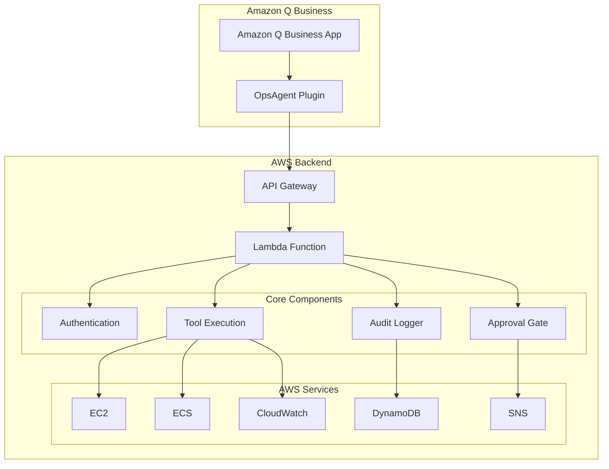

# Amazon Q Business Integration Guide for OpsAgent Controller

## Table of Contents

1. [Overview](#overview)
2. [Prerequisites](#prerequisites)
3. [Complete Setup Process](#complete-setup-process)
4. [Plugin Operations Reference](#plugin-operations-reference)
5. [Sample Requests and Responses](#sample-requests-and-responses)
6. [Troubleshooting Guide](#troubleshooting-guide)
7. [Security Best Practices](#security-best-practices)
8. [Operational Guidelines](#operational-guidelines)
9. [Monitoring and Maintenance](#monitoring-and-maintenance)
10. [Advanced Configuration](#advanced-configuration)

## Overview

The OpsAgent Controller integrates with Amazon Q Business through a custom plugin that provides secure, auditable AWS operations directly from your chat interface. This integration enables platform engineers to perform diagnostic and remediation tasks while maintaining strict security controls and comprehensive audit trails.

### Key Features

- **8 Operational Categories**: Diagnostic (4), Write (2), and Workflow (2) operations
- **Approval Workflow**: All write operations require explicit approval with time-limited tokens
- **Tag-Based Security**: Write operations restricted to resources tagged `OpsAgentManaged=true`
- **Comprehensive Audit**: All operations logged with correlation IDs and user tracking
- **Multiple Execution Modes**: LOCAL_MOCK, DRY_RUN, and SANDBOX_LIVE for safe testing
- **Real-time Monitoring**: CloudWatch integration for performance and error tracking

### Architecture Overview



## Prerequisites

### AWS Account Requirements

1. **Amazon Q Business Application**: Configured and accessible
2. **OpsAgent Infrastructure**: Deployed via SAM/CloudFormation
3. **IAM Permissions**: Admin access to Amazon Q Business console
4. **AWS CLI**: Configured with appropriate permissions

### Required AWS Services

- **API Gateway**: RESTful API endpoint
- **AWS Lambda**: Python 3.11 runtime
- **DynamoDB**: Audit logging and incident storage
- **CloudWatch**: Metrics and logging
- **SSM Parameter Store**: Configuration management
- **IAM**: Role-based access control

### Supported Environments

- **Sandbox**: Full testing with tagged resources
- **Staging**: Pre-production validation
- **Production**: Live operations with strict controls

## Complete Setup Process

### Step 1: Deploy OpsAgent Infrastructure

#### 1.1 Clone and Prepare Repository

```bash
# Clone the repository
git clone https://github.com/your-org/ops-agent-controller.git
cd ops-agent-controller

# Install dependencies
pip install -r requirements.txt
pip install -r requirements-dev.txt
```

#### 1.2 Configure Environment

```bash
# Set environment variables
export ENVIRONMENT=sandbox
export AWS_REGION=us-east-1
export EXECUTION_MODE=SANDBOX_LIVE

# Configure AWS CLI if not already done
aws configure
```

#### 1.3 Deploy Infrastructure

```bash
# Build the SAM application
sam build

# Deploy with guided configuration
sam deploy --guided

# Or deploy with specific parameters
sam deploy \
  --parameter-overrides \
    "Environment=sandbox" \
    "ExecutionMode=SANDBOX_LIVE" \
    "AllowedUsers=user1@company.com,user2@company.com"
```

#### 1.4 Verify Deployment

```bash
# Get stack outputs
aws cloudformation describe-stacks \
  --stack-name opsagent-controller-sandbox \
  --query 'Stacks[0].Outputs'

# Test health endpoint
HEALTH_URL=$(aws cloudformation describe-stacks \
  --stack-name opsagent-controller-sandbox \
  --query 'Stacks[0].Outputs[?OutputKey==`HealthEndpoint`].OutputValue' \
  --output text)

curl "$HEALTH_URL"
```

### Step 2: Configure Amazon Q Business Plugin

#### 2.1 Gather Required Information

```bash
# Get API endpoint URL
API_ENDPOINT=$(aws cloudformation describe-stacks \
  --stack-name opsagent-controller-sandbox \
  --query 'Stacks[0].Outputs[?OutputKey==`ChatEndpoint`].OutputValue' \
  --output text)

# Get API key
API_KEY=$(aws ssm get-parameter \
  --name "/opsagent/sandbox/api-key" \
  --with-decryption \
  --query 'Parameter.Value' \
  --output text)

echo "API Endpoint: $API_ENDPOINT"
echo "API Key: ${API_KEY:0:10}..."
```

#### 2.2 Prepare OpenAPI Schema

Update the OpenAPI schema with your API endpoint:

```bash
# Copy and update the schema file
cp infrastructure/openapi-q-compatible.yaml /tmp/opsagent-plugin-schema.yaml

# Replace placeholder with actual endpoint
sed -i "s|\${API_ENDPOINT}|$API_ENDPOINT|g" /tmp/opsagent-plugin-schema.yaml
```

#### 2.3 Create Plugin in Amazon Q Business Console

1. **Navigate to Amazon Q Business Console**
   - Go to [Amazon Q Business Console](https://console.aws.amazon.com/amazonq/business/)
   - Select your Amazon Q Business application

2. **Create New Plugin**
   - Click **Plugins** in the left navigation
   - Click **Create plugin**
   - Select **Custom plugin**

3. **Configure Plugin Details**
   ```
   Plugin name: OpsAgent Actions
   Description: Secure AWS operations for platform engineers
   Plugin type: Custom plugin
   ```

4. **Upload API Schema**
   - **API schema source**: Upload file
   - **File**: Select `/tmp/opsagent-plugin-schema.yaml`
   - **Base URL**: Your API endpoint URL

5. **Configure Authentication**
   ```
   Authentication type: API Key
   API Key location: Header
   API Key name: X-API-Key
   API Key value: [Your API key from Step 2.1]
   ```

6. **Set Plugin Permissions**
   ```
   Enable plugin: Yes
   Require approval: No (handled internally)
   Allowed users: Configure based on your needs
   Timeout: 30 seconds
   Retry attempts: 2
   ```

### Step 3: Test Plugin Integration

#### 3.1 Basic Health Check

```bash
# Test plugin connection in Amazon Q Business console
# Go to Plugins → OpsAgent Actions → Test connection
# Should return 200 OK with health status
```

#### 3.2 Diagnostic Operation Test

In Amazon Q Business chat interface:

```
User: Get status of EC2 instance i-1234567890abcdef0
Expected: Plugin returns instance status and metrics
```

#### 3.3 Approval Workflow Test

```
User: Reboot EC2 instance i-1234567890abcdef0 due to high CPU
Expected: Plugin returns approval token and instructions

User: Approve action with token approve-abc123def456
Expected: Plugin executes action or simulates in DRY_RUN mode
```

### Step 4: Configure User Access and Security

#### 4.1 Update User Allow-list

```bash
# Update allowed users in SSM Parameter Store
aws ssm put-parameter \
  --name "/opsagent/sandbox/allowed-users" \
  --value "user1@company.com,user2@company.com,admin@company.com" \
  --type "StringList" \
  --overwrite
```

#### 4.2 Tag Resources for Management

```bash
# Tag EC2 instances for OpsAgent management
aws ec2 create-tags \
  --resources i-1234567890abcdef0 \
  --tags Key=OpsAgentManaged,Value=true Key=Environment,Value=sandbox

# Tag ECS services
aws ecs tag-resource \
  --resource-arn arn:aws:ecs:region:account:service/cluster/service \
  --tags key=OpsAgentManaged,value=true key=Environment,value=sandbox
```

#### 4.3 Configure Monitoring

```bash
# Create CloudWatch dashboard
aws cloudwatch put-dashboard \
  --dashboard-name "OpsAgent-Controller-Sandbox" \
  --dashboard-body file://monitoring/dashboard.json

# Set up alarms
aws cloudwatch put-metric-alarm \
  --alarm-name "OpsAgent-High-Error-Rate" \
  --alarm-description "High error rate in OpsAgent Controller" \
  --metric-name "Errors" \
  --namespace "AWS/Lambda" \
  --statistic "Sum" \
  --period 300 \
  --threshold 5 \
  --comparison-operator "GreaterThanThreshold" \
  --dimensions Name=FunctionName,Value=opsagent-controller-sandbox \
  --evaluation-periods 2
```

## Plugin Operations Reference

### Diagnostic Operations (No Approval Required)

#### 1. get_ec2_status
**Purpose**: Get EC2 instance status and basic metrics

**Parameters**:
- `instance_id` (required): EC2 instance ID
- `metrics` (optional): Array of metrics to retrieve ["cpu", "memory", "network"]
- `time_window` (optional): Time window for metrics (default: "15m")

**Example Request**:
```json
{
  "operation": "get_ec2_status",
  "parameters": {
    "instance_id": "i-1234567890abcdef0",
    "metrics": ["cpu", "memory", "network"],
    "time_window": "1h"
  }
}
```

#### 2. get_cloudwatch_metrics
**Purpose**: Retrieve CloudWatch metrics for resources

**Parameters**:
- `namespace` (required): CloudWatch namespace (e.g., "AWS/EC2")
- `metric_name` (required): Metric name (e.g., "CPUUtilization")
- `resource_id` (required): Resource identifier
- `time_window` (optional): Time window (default: "15m")
- `statistic` (optional): Statistic type (default: "Average")

**Example Request**:
```json
{
  "operation": "get_cloudwatch_metrics",
  "parameters": {
    "namespace": "AWS/EC2",
    "metric_name": "CPUUtilization",
    "resource_id": "i-1234567890abcdef0",
    "time_window": "1h",
    "statistic": "Average"
  }
}
```

#### 3. describe_alb_target_health
**Purpose**: Check ALB/Target Group health status

**Parameters**:
- `alb_arn` OR `target_group_arn` (required): Load balancer or target group ARN

**Example Request**:
```json
{
  "operation": "describe_alb_target_health",
  "parameters": {
    "alb_arn": "arn:aws:elasticloadbalancing:us-east-1:123456789012:loadbalancer/app/my-alb/1234567890123456"
  }
}
```

#### 4. search_cloudtrail_events
**Purpose**: Search CloudTrail events with filters

**Parameters**:
- `event_name` (optional): CloudTrail event name filter
- `resource_name` (optional): Resource name filter
- `time_window` (optional): Time window (default: "1h")
- `max_results` (optional): Maximum results (default: 50)

**Example Request**:
```json
{
  "operation": "search_cloudtrail_events",
  "parameters": {
    "event_name": "RunInstances",
    "time_window": "24h",
    "max_results": 20
  }
}
```

### Write Operations (Approval Required)

#### 5. reboot_ec2
**Purpose**: Reboot an EC2 instance

**Parameters**:
- `instance_id` (required): EC2 instance ID
- `reason` (optional): Reason for reboot

**Approval Required**: Yes
**Tag Validation**: Must have `OpsAgentManaged=true`

**Example Request**:
```json
{
  "operation": "reboot_ec2",
  "parameters": {
    "instance_id": "i-1234567890abcdef0",
    "reason": "High CPU utilization, unresponsive to SSH"
  }
}
```

#### 6. scale_ecs_service
**Purpose**: Scale ECS service desired count

**Parameters**:
- `cluster` (required): ECS cluster name
- `service` (required): ECS service name
- `desired_count` (required): New desired task count

**Approval Required**: Yes
**Tag Validation**: Must have `OpsAgentManaged=true`

**Example Request**:
```json
{
  "operation": "scale_ecs_service",
  "parameters": {
    "cluster": "production-cluster",
    "service": "web-service",
    "desired_count": 5
  }
}
```

### Workflow Operations (No Approval, Fully Audited)

#### 7. create_incident_record
**Purpose**: Create incident record for workflow management

**Parameters**:
- `summary` (required): Incident summary
- `severity` (required): Severity level ["low", "medium", "high", "critical"]
- `links` (optional): Array of relevant links

**Example Request**:
```json
{
  "operation": "create_incident_record",
  "parameters": {
    "summary": "High CPU utilization on production instances",
    "severity": "medium",
    "links": [
      "https://console.aws.amazon.com/ec2/v2/home#Instances:",
      "https://monitoring.company.com/dashboard/ec2"
    ]
  }
}
```

#### 8. post_summary_to_channel
**Purpose**: Post operational summary to Teams channel

**Parameters**:
- `text` (required): Message text to post
- `channel` (optional): Channel identifier
- `webhook_url` (optional): Webhook URL for posting

**Example Request**:
```json
{
  "operation": "post_summary_to_channel",
  "parameters": {
    "text": "System status update: All services operational after maintenance",
    "channel": "ops-alerts"
  }
}
```

## Sample Requests and Responses

### Diagnostic Operation Example

**Request via Amazon Q Business**:
```
User: "Show me CPU metrics for instance i-1234567890abcdef0 over the last hour"
```

**Plugin API Call**:
```json
{
  "operation": "get_cloudwatch_metrics",
  "parameters": {
    "namespace": "AWS/EC2",
    "metric_name": "CPUUtilization",
    "resource_id": "i-1234567890abcdef0",
    "time_window": "1h"
  },
  "user_context": {
    "user_id": "user@company.com",
    "teams_tenant": "company.onmicrosoft.com"
  }
}
```

**Plugin Response**:
```json
{
  "success": true,
  "summary": "CPU utilization for i-1234567890abcdef0: Average 45.2% over last hour",
  "details": {
    "instance_id": "i-1234567890abcdef0",
    "metric_name": "CPUUtilization",
    "time_window": "1h",
    "statistics": {
      "average": 45.2,
      "maximum": 78.5,
      "minimum": 12.3
    },
    "data_points": [
      {"timestamp": "2024-01-15T10:00:00Z", "value": 45.2},
      {"timestamp": "2024-01-15T10:05:00Z", "value": 48.1}
    ]
  },
  "execution_mode": "SANDBOX_LIVE",
  "correlation_id": "req-uuid-123"
}
```

**Amazon Q Business Display**:
```
CPU utilization for instance i-1234567890abcdef0:
• Average: 45.2% over the last hour
• Maximum: 78.5%
• Minimum: 12.3%
• Current trend: Stable

The instance is operating within normal parameters. CPU usage shows typical variation for a web server workload.
```

### Write Operation with Approval Example

**Request via Amazon Q Business**:
```
User: "Reboot instance i-1234567890abcdef0 due to high memory usage"
```

**Plugin API Call (Step 1 - Propose)**:
```json
{
  "operation": "propose_action",
  "parameters": {
    "action": "reboot_ec2",
    "instance_id": "i-1234567890abcdef0",
    "reason": "High memory usage"
  },
  "user_context": {
    "user_id": "user@company.com",
    "teams_tenant": "company.onmicrosoft.com"
  }
}
```

**Plugin Response (Step 1)**:
```json
{
  "success": true,
  "approval_required": true,
  "approval_token": "approve-abc123def456",
  "expires_at": "2024-01-15T10:30:00Z",
  "action_summary": "Reboot EC2 instance i-1234567890abcdef0",
  "risk_level": "medium",
  "impact_assessment": {
    "downtime": "2-5 minutes",
    "affected_services": ["web-app"],
    "recovery_time": "automatic"
  },
  "instructions": "To proceed, use: approve_action with token 'approve-abc123def456'",
  "correlation_id": "req-uuid-124"
}
```

**Amazon Q Business Display (Step 1)**:
```
I'll help you reboot instance i-1234567890abcdef0. This action requires approval due to potential service impact.

Action Summary:
• Operation: Reboot EC2 instance
• Instance: i-1234567890abcdef0
• Reason: High memory usage
• Risk Level: Medium
• Expected Downtime: 2-5 minutes

To proceed, please respond with:
"approve token:approve-abc123def456"

This approval token expires at 10:30 AM UTC (15 minutes).
```

**User Approval**:
```
User: "approve token:approve-abc123def456"
```

**Plugin API Call (Step 2 - Execute)**:
```json
{
  "operation": "approve_action",
  "parameters": {
    "token": "approve-abc123def456"
  },
  "user_context": {
    "user_id": "user@company.com",
    "teams_tenant": "company.onmicrosoft.com"
  }
}
```

**Plugin Response (Step 2)**:
```json
{
  "success": true,
  "action_executed": true,
  "execution_details": {
    "operation": "reboot_ec2",
    "instance_id": "i-1234567890abcdef0",
    "status": "initiated",
    "expected_completion": "2024-01-15T10:18:00Z"
  },
  "monitoring": {
    "check_status_in": "2 minutes",
    "recovery_expected": "5 minutes"
  },
  "correlation_id": "req-uuid-124"
}
```

**Amazon Q Business Display (Step 2)**:
```
✅ Approval Granted - Reboot Initiated

Instance i-1234567890abcdef0 reboot has been initiated successfully.

Status:
• Operation: In Progress
• Expected Completion: 10:18 AM UTC
• Recovery Time: ~5 minutes

You can monitor the instance status in the AWS Console or ask me to check the status in a few minutes.
```

### Workflow Operation Example

**Request via Amazon Q Business**:
```
User: "Create an incident record for the high CPU issue with medium severity"
```

**Plugin API Call**:
```json
{
  "operation": "create_incident_record",
  "parameters": {
    "summary": "High CPU utilization on production instances",
    "severity": "medium",
    "links": [
      "https://console.aws.amazon.com/ec2/v2/home#Instances:",
      "https://monitoring.company.com/dashboard/ec2"
    ]
  },
  "user_context": {
    "user_id": "user@company.com",
    "teams_tenant": "company.onmicrosoft.com"
  }
}
```

**Plugin Response**:
```json
{
  "success": true,
  "incident_id": "INC-2024-001234",
  "created_at": "2024-01-15T10:15:00Z",
  "details": {
    "summary": "High CPU utilization on production instances",
    "severity": "medium",
    "status": "open",
    "assigned_to": "ops-team",
    "links": [
      "https://console.aws.amazon.com/ec2/v2/home#Instances:",
      "https://monitoring.company.com/dashboard/ec2"
    ]
  },
  "notification_sent": true,
  "correlation_id": "req-uuid-125"
}
```

**Amazon Q Business Display**:
```
✅ Incident Record Created

Incident INC-2024-001234 has been created successfully.

Details:
• Summary: High CPU utilization on production instances
• Severity: Medium
• Status: Open
• Created: 10:15 AM UTC
• Assigned: ops-team

Notifications have been sent to the operations team. You can track this incident in your incident management system.
```

## Troubleshooting Guide

### Common Integration Issues

#### 1. Plugin Connection Failed

**Symptoms**:
- Amazon Q Business shows "Plugin connection failed"
- Test connection returns error

**Causes & Solutions**:

```bash
# Check API endpoint accessibility
curl -I "$API_ENDPOINT/health"
# Should return 200 OK

# Verify API key
curl -H "X-API-Key: $API_KEY" "$API_ENDPOINT/health"
# Should return health status

# Check CloudFormation stack status
aws cloudformation describe-stacks --stack-name opsagent-controller-sandbox
# Stack should be CREATE_COMPLETE or UPDATE_COMPLETE
```

#### 2. Authentication Errors

**Symptoms**:
- "Authentication failed" or "Invalid API key"
- 401 Unauthorized responses

**Solutions**:

```bash
# Regenerate API key
aws ssm put-parameter \
  --name "/opsagent/sandbox/api-key" \
  --value "$(openssl rand -base64 32)" \
  --type "SecureString" \
  --overwrite

# Update plugin configuration with new API key
# Go to Amazon Q Business Console → Plugins → OpsAgent Actions → Edit
```

#### 3. Operation Not Found

**Symptoms**:
- "Operation not supported" errors
- Plugin returns 404 for valid operations

**Solutions**:

```bash
# Update OpenAPI schema
cp infrastructure/openapi-q-compatible.yaml /tmp/updated-schema.yaml
sed -i "s|\${API_ENDPOINT}|$API_ENDPOINT|g" /tmp/updated-schema.yaml

# Upload updated schema to Amazon Q Business plugin
# Go to Amazon Q Business Console → Plugins → OpsAgent Actions → Edit → Upload new schema
```

#### 4. Resource Access Denied

**Symptoms**:
- "Resource not found" or "Access denied"
- Operations fail on existing resources

**Solutions**:

```bash
# Check resource tagging
aws ec2 describe-tags --filters "Name=resource-id,Values=i-1234567890abcdef0"
# Should show OpsAgentManaged=true

# Add required tag
aws ec2 create-tags \
  --resources i-1234567890abcdef0 \
  --tags Key=OpsAgentManaged,Value=true

# Check IAM permissions
aws iam simulate-principal-policy \
  --policy-source-arn "arn:aws:iam::account:role/opsagent-controller-sandbox-role" \
  --action-names "ec2:DescribeInstances" \
  --resource-arns "*"
```

#### 5. Approval Token Issues

**Symptoms**:
- "Token expired" or "Token not found"
- Approval workflow fails

**Solutions**:

```bash
# Check token expiry (15 minutes default)
# Generate new approval by re-proposing the action

# Check DynamoDB table for approval tokens
aws dynamodb scan \
  --table-name opsagent-approvals-sandbox \
  --filter-expression "expires_at > :now" \
  --expression-attribute-values '{":now":{"N":"'$(date +%s)'"}}'
```

### Performance Issues

#### 1. Slow Response Times

**Diagnostic Steps**:

```bash
# Check Lambda function performance
aws logs filter-log-events \
  --log-group-name /aws/lambda/opsagent-controller-sandbox \
  --filter-pattern "REPORT" \
  --start-time $(date -d '1 hour ago' +%s)000

# Check API Gateway metrics
aws cloudwatch get-metric-statistics \
  --namespace AWS/ApiGateway \
  --metric-name Latency \
  --dimensions Name=ApiName,Value=opsagent-controller-sandbox \
  --start-time $(date -d '1 hour ago' --iso-8601) \
  --end-time $(date --iso-8601) \
  --period 300 \
  --statistics Average,Maximum
```

**Solutions**:
- Increase Lambda memory allocation
- Optimize database queries
- Enable API Gateway caching
- Use CloudWatch insights for detailed analysis

#### 2. High Error Rates

**Diagnostic Steps**:

```bash
# Check error patterns
aws logs filter-log-events \
  --log-group-name /aws/lambda/opsagent-controller-sandbox \
  --filter-pattern "ERROR" \
  --start-time $(date -d '1 hour ago' +%s)000

# Check specific error types
aws logs filter-log-events \
  --log-group-name /aws/lambda/opsagent-controller-sandbox \
  --filter-pattern "{ $.level = \"ERROR\" }" \
  --start-time $(date -d '1 hour ago' +%s)000
```

### Monitoring and Alerting

#### CloudWatch Dashboards

Create comprehensive monitoring dashboards:

```json
{
  "widgets": [
    {
      "type": "metric",
      "properties": {
        "metrics": [
          ["AWS/Lambda", "Invocations", "FunctionName", "opsagent-controller-sandbox"],
          [".", "Errors", ".", "."],
          [".", "Duration", ".", "."]
        ],
        "period": 300,
        "stat": "Sum",
        "region": "us-east-1",
        "title": "Lambda Metrics"
      }
    },
    {
      "type": "log",
      "properties": {
        "query": "SOURCE '/aws/lambda/opsagent-controller-sandbox'\n| fields @timestamp, @message\n| filter @message like /ERROR/\n| sort @timestamp desc\n| limit 20",
        "region": "us-east-1",
        "title": "Recent Errors"
      }
    }
  ]
}
```

#### CloudWatch Alarms

Set up critical alarms:

```bash
# High error rate alarm
aws cloudwatch put-metric-alarm \
  --alarm-name "OpsAgent-High-Error-Rate" \
  --alarm-description "High error rate in OpsAgent Controller" \
  --metric-name "Errors" \
  --namespace "AWS/Lambda" \
  --statistic "Sum" \
  --period 300 \
  --threshold 5 \
  --comparison-operator "GreaterThanThreshold" \
  --dimensions Name=FunctionName,Value=opsagent-controller-sandbox \
  --evaluation-periods 2 \
  --alarm-actions "arn:aws:sns:us-east-1:123456789012:ops-alerts"

# High latency alarm
aws cloudwatch put-metric-alarm \
  --alarm-name "OpsAgent-High-Latency" \
  --alarm-description "High latency in OpsAgent Controller" \
  --metric-name "Duration" \
  --namespace "AWS/Lambda" \
  --statistic "Average" \
  --period 300 \
  --threshold 10000 \
  --comparison-operator "GreaterThanThreshold" \
  --dimensions Name=FunctionName,Value=opsagent-controller-sandbox \
  --evaluation-periods 2
```

## Security Best Practices

### Access Control

#### 1. User Authentication and Authorization

```bash
# Maintain strict user allow-lists
aws ssm put-parameter \
  --name "/opsagent/sandbox/allowed-users" \
  --value "admin@company.com,ops-lead@company.com" \
  --type "StringList" \
  --overwrite

# Regular access reviews (monthly)
aws ssm get-parameter \
  --name "/opsagent/sandbox/allowed-users" \
  --query 'Parameter.Value'
```

#### 2. Resource Tagging Enforcement

```bash
# Audit resource tags regularly
aws ec2 describe-instances \
  --filters "Name=tag:OpsAgentManaged,Values=true" \
  --query 'Reservations[].Instances[].[InstanceId,Tags[?Key==`OpsAgentManaged`].Value|[0]]'

# Automated tagging compliance check
aws config put-config-rule \
  --config-rule '{
    "ConfigRuleName": "opsagent-managed-tag-compliance",
    "Source": {
      "Owner": "AWS",
      "SourceIdentifier": "REQUIRED_TAGS"
    },
    "InputParameters": "{\"tag1Key\":\"OpsAgentManaged\",\"tag1Value\":\"true\"}"
  }'
```

#### 3. API Key Management

```bash
# Rotate API keys quarterly
NEW_API_KEY=$(openssl rand -base64 32)
aws ssm put-parameter \
  --name "/opsagent/sandbox/api-key" \
  --value "$NEW_API_KEY" \
  --type "SecureString" \
  --overwrite

# Update Amazon Q Business plugin with new key
echo "Update plugin configuration with new API key: ${NEW_API_KEY:0:10}..."
```

### Network Security

#### 1. VPC Configuration

```yaml
# CloudFormation template for VPC endpoints
VPCEndpointDynamoDB:
  Type: AWS::EC2::VPCEndpoint
  Properties:
    VpcId: !Ref VPC
    ServiceName: !Sub 'com.amazonaws.${AWS::Region}.dynamodb'
    VpcEndpointType: Gateway
    RouteTableIds:
      - !Ref PrivateRouteTable

VPCEndpointSSM:
  Type: AWS::EC2::VPCEndpoint
  Properties:
    VpcId: !Ref VPC
    ServiceName: !Sub 'com.amazonaws.${AWS::Region}.ssm'
    VpcEndpointType: Interface
    SubnetIds:
      - !Ref PrivateSubnet
```

#### 2. Security Groups

```bash
# Restrict Lambda security group
aws ec2 authorize-security-group-egress \
  --group-id sg-lambda-opsagent \
  --protocol tcp \
  --port 443 \
  --cidr 0.0.0.0/0 \
  --description "HTTPS outbound for AWS API calls"

# Remove default allow-all rule
aws ec2 revoke-security-group-egress \
  --group-id sg-lambda-opsagent \
  --protocol -1 \
  --cidr 0.0.0.0/0
```

### Audit and Compliance

#### 1. Comprehensive Logging

```bash
# Enable CloudTrail for API calls
aws cloudtrail create-trail \
  --name opsagent-audit-trail \
  --s3-bucket-name opsagent-audit-logs \
  --include-global-service-events \
  --is-multi-region-trail \
  --enable-log-file-validation

# Configure log retention
aws logs put-retention-policy \
  --log-group-name /aws/lambda/opsagent-controller-sandbox \
  --retention-in-days 90
```

#### 2. Audit Log Analysis

```bash
# Query audit logs for specific operations
aws logs start-query \
  --log-group-name /opsagent/sandbox/audit \
  --start-time $(date -d '24 hours ago' +%s) \
  --end-time $(date +%s) \
  --query-string 'fields @timestamp, operation, user_id, success | filter operation = "reboot_ec2" | sort @timestamp desc'

# Export audit logs for compliance
aws logs create-export-task \
  --log-group-name /opsagent/sandbox/audit \
  --from $(date -d '30 days ago' +%s)000 \
  --to $(date +%s)000 \
  --destination opsagent-compliance-exports \
  --destination-prefix audit-logs/$(date +%Y/%m/%d)/
```

## Operational Guidelines

### Daily Operations

#### 1. Health Monitoring

```bash
#!/bin/bash
# Daily health check script

# Check system health
HEALTH_STATUS=$(curl -s -H "X-API-Key: $API_KEY" "$HEALTH_ENDPOINT" | jq -r '.data.status')
if [ "$HEALTH_STATUS" != "healthy" ]; then
  echo "ALERT: OpsAgent Controller unhealthy - $HEALTH_STATUS"
  # Send alert to operations team
fi

# Check error rates
ERROR_COUNT=$(aws logs filter-log-events \
  --log-group-name /aws/lambda/opsagent-controller-sandbox \
  --filter-pattern "ERROR" \
  --start-time $(date -d '24 hours ago' +%s)000 \
  --query 'length(events)')

if [ "$ERROR_COUNT" -gt 10 ]; then
  echo "ALERT: High error count in last 24 hours - $ERROR_COUNT errors"
fi

# Check approval token usage
PENDING_APPROVALS=$(aws dynamodb scan \
  --table-name opsagent-approvals-sandbox \
  --filter-expression "expires_at > :now AND consumed = :false" \
  --expression-attribute-values '{
    ":now":{"N":"'$(date +%s)'"},
    ":false":{"BOOL":false}
  }' \
  --select COUNT \
  --query 'Count')

echo "Pending approvals: $PENDING_APPROVALS"
```

#### 2. Resource Management

```bash
# Daily resource audit
aws ec2 describe-instances \
  --filters "Name=tag:OpsAgentManaged,Values=true" \
  --query 'Reservations[].Instances[].[InstanceId,State.Name,Tags[?Key==`Environment`].Value|[0]]' \
  --output table

# Check ECS services
aws ecs list-services --cluster production-cluster \
  --query 'serviceArns[]' \
  --output text | while read service_arn; do
    aws ecs describe-services \
      --cluster production-cluster \
      --services "$service_arn" \
      --query 'services[0].[serviceName,desiredCount,runningCount,pendingCount]' \
      --output text
done
```

### Weekly Maintenance

#### 1. Access Review

```bash
#!/bin/bash
# Weekly access review script

echo "=== Weekly OpsAgent Access Review ==="
echo "Date: $(date)"
echo ""

# Get current allowed users
echo "Current allowed users:"
aws ssm get-parameter \
  --name "/opsagent/sandbox/allowed-users" \
  --query 'Parameter.Value' \
  --output text | tr ',' '\n'

echo ""

# Get users who actually used the system
echo "Active users in last 7 days:"
aws logs filter-log-events \
  --log-group-name /opsagent/sandbox/audit \
  --filter-pattern "{ $.event_type = \"request_received\" }" \
  --start-time $(date -d '7 days ago' +%s)000 \
  --query 'events[].message' \
  --output text | jq -r '.user_id' | sort | uniq

echo ""

# Get operations performed
echo "Operations performed in last 7 days:"
aws logs filter-log-events \
  --log-group-name /opsagent/sandbox/audit \
  --filter-pattern "{ $.event_type = \"tool_call_executed\" }" \
  --start-time $(date -d '7 days ago' +%s)000 \
  --query 'events[].message' \
  --output text | jq -r '.operation' | sort | uniq -c | sort -nr
```

#### 2. Performance Review

```bash
# Weekly performance metrics
aws cloudwatch get-metric-statistics \
  --namespace AWS/Lambda \
  --metric-name Duration \
  --dimensions Name=FunctionName,Value=opsagent-controller-sandbox \
  --start-time $(date -d '7 days ago' --iso-8601) \
  --end-time $(date --iso-8601) \
  --period 86400 \
  --statistics Average,Maximum \
  --output table

# API Gateway metrics
aws cloudwatch get-metric-statistics \
  --namespace AWS/ApiGateway \
  --metric-name Count \
  --dimensions Name=ApiName,Value=opsagent-controller-sandbox \
  --start-time $(date -d '7 days ago' --iso-8601) \
  --end-time $(date --iso-8601) \
  --period 86400 \
  --statistics Sum \
  --output table
```

### Monthly Tasks

#### 1. Security Audit

```bash
#!/bin/bash
# Monthly security audit

echo "=== Monthly OpsAgent Security Audit ==="
echo "Date: $(date)"
echo ""

# Check IAM role permissions
echo "Checking IAM role permissions..."
aws iam get-role-policy \
  --role-name opsagent-controller-sandbox-role \
  --policy-name OpsAgentExecutionPolicy \
  --query 'PolicyDocument.Statement[].Action[]' \
  --output text | sort

# Check resource tags compliance
echo ""
echo "Checking resource tag compliance..."
UNTAGGED_INSTANCES=$(aws ec2 describe-instances \
  --filters "Name=instance-state-name,Values=running" \
  --query 'Reservations[].Instances[?!Tags || !Tags[?Key==`OpsAgentManaged`]].[InstanceId]' \
  --output text | wc -l)

echo "Untagged running instances: $UNTAGGED_INSTANCES"

# Check API key age
echo ""
echo "Checking API key age..."
API_KEY_DATE=$(aws ssm describe-parameters \
  --parameter-filters "Key=Name,Values=/opsagent/sandbox/api-key" \
  --query 'Parameters[0].LastModifiedDate' \
  --output text)

echo "API key last modified: $API_KEY_DATE"

# Check for unused approval tokens
echo ""
echo "Checking for expired approval tokens..."
EXPIRED_TOKENS=$(aws dynamodb scan \
  --table-name opsagent-approvals-sandbox \
  --filter-expression "expires_at < :now" \
  --expression-attribute-values '{":now":{"N":"'$(date +%s)'"}}' \
  --select COUNT \
  --query 'Count')

echo "Expired tokens to clean up: $EXPIRED_TOKENS"
```

#### 2. Capacity Planning

```bash
# Monthly capacity analysis
echo "=== Monthly Capacity Analysis ==="

# Lambda invocation trends
aws cloudwatch get-metric-statistics \
  --namespace AWS/Lambda \
  --metric-name Invocations \
  --dimensions Name=FunctionName,Value=opsagent-controller-sandbox \
  --start-time $(date -d '30 days ago' --iso-8601) \
  --end-time $(date --iso-8601) \
  --period 86400 \
  --statistics Sum \
  --query 'Datapoints[].Sum' \
  --output text | awk '{sum+=$1} END {print "Average daily invocations:", sum/30}'

# DynamoDB usage
aws cloudwatch get-metric-statistics \
  --namespace AWS/DynamoDB \
  --metric-name ConsumedReadCapacityUnits \
  --dimensions Name=TableName,Value=opsagent-audit-sandbox \
  --start-time $(date -d '30 days ago' --iso-8601) \
  --end-time $(date --iso-8601) \
  --period 86400 \
  --statistics Sum \
  --output table
```

## Advanced Configuration

### Multi-Environment Setup

#### 1. Environment-Specific Configuration

```yaml
# parameters.yaml for different environments
sandbox:
  ExecutionMode: DRY_RUN
  AllowedUsers: "dev1@company.com,dev2@company.com"
  LogLevel: DEBUG
  
staging:
  ExecutionMode: SANDBOX_LIVE
  AllowedUsers: "ops1@company.com,ops2@company.com"
  LogLevel: INFO
  
production:
  ExecutionMode: SANDBOX_LIVE
  AllowedUsers: "admin@company.com,ops-lead@company.com"
  LogLevel: WARN
```

#### 2. Automated Deployment Pipeline

```yaml
# .github/workflows/deploy.yml
name: Deploy OpsAgent Controller

on:
  push:
    branches: [main]
  pull_request:
    branches: [main]

jobs:
  test:
    runs-on: ubuntu-latest
    steps:
      - uses: actions/checkout@v3
      - name: Set up Python
        uses: actions/setup-python@v4
        with:
          python-version: '3.11'
      - name: Install dependencies
        run: |
          pip install -r requirements.txt
          pip install -r requirements-dev.txt
      - name: Run tests
        run: pytest tests/ -v
      - name: Run smoke tests
        run: python tests/run_smoke_tests.py --suite smoke

  deploy-sandbox:
    needs: test
    if: github.ref == 'refs/heads/main'
    runs-on: ubuntu-latest
    steps:
      - uses: actions/checkout@v3
      - name: Configure AWS credentials
        uses: aws-actions/configure-aws-credentials@v2
        with:
          aws-access-key-id: ${{ secrets.AWS_ACCESS_KEY_ID }}
          aws-secret-access-key: ${{ secrets.AWS_SECRET_ACCESS_KEY }}
          aws-region: us-east-1
      - name: Deploy to sandbox
        run: |
          sam build
          sam deploy \
            --stack-name opsagent-controller-sandbox \
            --parameter-overrides \
              Environment=sandbox \
              ExecutionMode=DRY_RUN \
              AllowedUsers="${{ secrets.SANDBOX_ALLOWED_USERS }}"
      - name: Run deployment tests
        run: |
          export ENVIRONMENT=sandbox
          export HEALTH_ENDPOINT=$(aws cloudformation describe-stacks \
            --stack-name opsagent-controller-sandbox \
            --query 'Stacks[0].Outputs[?OutputKey==`HealthEndpoint`].OutputValue' \
            --output text)
          python tests/run_smoke_tests.py --suite readiness
```

### Custom Integrations

#### 1. PagerDuty Integration

```python
# Custom workflow tool for PagerDuty integration
import requests
import json

class PagerDutyIntegration:
    def __init__(self, integration_key):
        self.integration_key = integration_key
        self.api_url = "https://events.pagerduty.com/v2/enqueue"
    
    def create_incident(self, summary, severity, source):
        payload = {
            "routing_key": self.integration_key,
            "event_action": "trigger",
            "payload": {
                "summary": summary,
                "severity": severity,
                "source": source,
                "component": "opsagent-controller",
                "group": "infrastructure"
            }
        }
        
        response = requests.post(
            self.api_url,
            headers={"Content-Type": "application/json"},
            data=json.dumps(payload)
        )
        
        return response.json()
```

#### 2. Slack Integration

```python
# Custom channel adapter for Slack
import requests
import json

class SlackChannelAdapter:
    def __init__(self, webhook_url):
        self.webhook_url = webhook_url
    
    def post_message(self, text, channel=None, attachments=None):
        payload = {
            "text": text,
            "username": "OpsAgent Controller",
            "icon_emoji": ":robot_face:"
        }
        
        if channel:
            payload["channel"] = channel
        
        if attachments:
            payload["attachments"] = attachments
        
        response = requests.post(
            self.webhook_url,
            headers={"Content-Type": "application/json"},
            data=json.dumps(payload)
        )
        
        return response.status_code == 200
```

### Performance Optimization

#### 1. Lambda Configuration Tuning

```yaml
# Optimized Lambda configuration
OpsAgentFunction:
  Type: AWS::Serverless::Function
  Properties:
    Runtime: python3.11
    Handler: main.lambda_handler
    MemorySize: 1024  # Increased for better performance
    Timeout: 60       # Increased for complex operations
    ReservedConcurrencyLimit: 10  # Prevent runaway costs
    Environment:
      Variables:
        PYTHONPATH: /var/runtime:/var/task
        AWS_LAMBDA_EXEC_WRAPPER: /opt/bootstrap
    Layers:
      - !Ref DependenciesLayer  # Pre-built dependencies
```

#### 2. DynamoDB Optimization

```yaml
# Optimized DynamoDB configuration
AuditTable:
  Type: AWS::DynamoDB::Table
  Properties:
    BillingMode: ON_DEMAND  # Auto-scaling
    StreamSpecification:
      StreamViewType: NEW_AND_OLD_IMAGES
    GlobalSecondaryIndexes:
      - IndexName: user-timestamp-index
        KeySchema:
          - AttributeName: user_id
            KeyType: HASH
          - AttributeName: timestamp
            KeyType: RANGE
        Projection:
          ProjectionType: INCLUDE
          NonKeyAttributes:
            - operation
            - success
            - correlation_id
```

This comprehensive integration guide provides everything needed to successfully deploy, configure, and operate the OpsAgent Controller with Amazon Q Business. The guide covers all aspects from initial setup through advanced operational procedures, ensuring teams can safely and effectively use the system for AWS operations management.